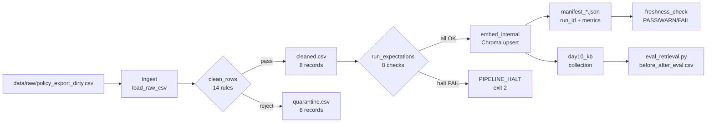

# Kiến trúc pipeline — Lab Day 10

**Nhóm:** Vinno (Hùng · Phú · Thông · Tiến)  
**Cập nhật:** 2026-04-15 | run_id: sprint-final-restore

---

## 1. Sơ đồ luồng

```
                              ┌──────────────────────────────────────────────────────────────┐
                              │                   ETL Pipeline (etl_pipeline.py)              │
                              │                                                                │
  data/raw/                   │  ┌──────────┐    ┌──────────┐    ┌──────────┐    ┌────────┐  │
  policy_export_dirty.csv ───►│  │  INGEST  │───►│  CLEAN   │───►│ VALIDATE │───►│ EMBED  │  │
                              │  │ (Sprint1)│    │(Sprint2) │    │(Sprint2) │    │(Sprint │  │
                              │  └──────────┘    └──────────┘    └──────────┘    │  2-3)  │  │
                              │       │               │ │              │          └────────┘  │
                              │  run_id + log    cleaned.csv  quarantine.csv   Chroma upsert  │
                              │  raw_records=14  cleaned=8    quarantine=6    collection=     │
                              │                                                day10_kb        │
                              └──────────────────────────────────────────────────────────────┘
                                       │                                           │
                                  artifacts/                                  chroma_db/
                                  manifests/                               (persistent,
                                  logs/                                      upsert by
                                  quarantine/                                chunk_id)
                                  cleaned/
                                       │
                                  FRESHNESS CHECK ◄─── manifest_*.json
                                  (monitoring/)
```



> **Điểm đo freshness:** manifest ghi `latest_exported_at` từ cleaned CSV → `monitoring/freshness_check.py` so sánh với clock hiện tại theo SLA=24h.  
> **run_id:** timestamp UTC (vd `2026-04-15T07-32Z`) hoặc tên rõ (`sprint-final`), xuất hiện trong mọi artifact.  
> **Quarantine:** file CSV riêng, không bị drop im lặng — mỗi dòng có cột `reason`.

---

## 2. Ranh giới trách nhiệm

| Thành phần | Input | Output | Owner nhóm |
|------------|-------|--------|------------|
| **Ingest** | `data/raw/policy_export_dirty.csv` | `List[Dict]` rows in memory, log `raw_records` | Nguyễn Công Hùng |
| **Transform / Clean** | raw rows (14) | cleaned rows (8) + quarantine rows (6) | Phùng Hữu Phú |
| **Quality / Validate** | cleaned rows | `ExpectationResult[]` + halt flag | Phùng Hữu Phú |
| **Embed** | `cleaned_*.csv` | ChromaDB `day10_kb` (upsert + prune) | Chu Thành Thông |
| **Monitor / Freshness** | `manifest_*.json` | PASS/WARN/FAIL + `age_hours` | Bùi Đức Tiến |

---

## 3. Idempotency & rerun

- **Upsert** theo `chunk_id` (sha256[:16] của `doc_id|chunk_text|seq`): rerun 2 lần không tạo duplicate vector.
- **Prune**: sau mỗi publish, xóa `chunk_id` trong collection mà KHÔNG có trong cleaned run hiện tại → `embed_prune_removed` ghi vào log (thực tế thấy `embed_prune_removed=1` khi clean run sau inject).
- **Index snapshot**: collection `day10_kb` luôn phản ánh trạng thái của lần `run` gần nhất — "publish boundary" rõ ràng.
- **Kiểm tra idempotency**: chạy `python etl_pipeline.py run --run-id test-idem` 2 lần liên tiếp → `embed_prune_removed` = 0 lần thứ 2, collection count không đổi.

---

## 4. Liên hệ Day 09

Pipeline Day 10 phục vụ cùng corpus `data/docs/` (5 file) nhưng dùng **collection riêng** `day10_kb` thay vì collection Day 09 để tránh ô nhiễm khi inject corruption (Sprint 3). Nếu agent Day 09 cần đọc KB sau khi pipeline Day 10 đã clean, chỉ cần trỏ `CHROMA_COLLECTION=day10_kb` trong `.env`. Cùng `CHROMA_DB_PATH`, khác `collection_name`.

---

## 5. Rủi ro đã biết

- **Freshness FAIL trên CSV mẫu**: `exported_at` = 2026-04-10, SLA = 24h → FAIL (tuổi ~121h). Đây là hành vi dự đoán được — xem Runbook mục "freshness_check=FAIL".
- **Unicode trên Windows console**: `→` trong log gây `UnicodeEncodeError` với codepage cp1252 → đã fix bằng ASCII `=>`.
- **Semantic ranking không đảm bảo top-3**: stale chunk "14 ngày" không luôn nằm trong top-3 (top-k=3) do vector similarity; dùng **expectation suite** (E3) là cơ chế phát hiện tin cậy hơn retrieval eval.
- **Model `all-MiniLM-L6-v2` không optimize cho tiếng Việt**: token hóa subword có thể ảnh hưởng ranking → cần xem xét multilingual model cho production.
